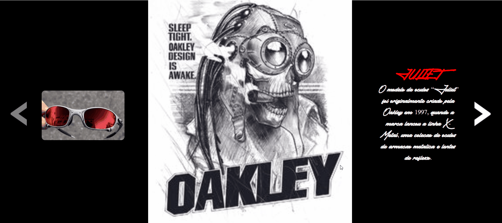

# Projeto oakley
[]

## Tecnologias utilizadas 
- HTML
- CSS
- JS
  
## Como utilizar?
Projeto oakley é um projeto de slides, basta clicar nas setas para ver proximo slide ou anterior.

 ## O que motivou a fazer esse projeto?
Bom, esse projeto foi feito para mostrar meus conhecimentos e tambem porque sou fã da marca, gosto dos modelos de óculos então resolvi criar um slide e falar sobre cada um dos modelos. 

## Dificuldades encontradas 
 Projeto oakley tive dificuldade apenas em encontar imagens que se adapta-se com o projeto.

## Link
(https://igorsousasilva.github.io/oakley/)
 
